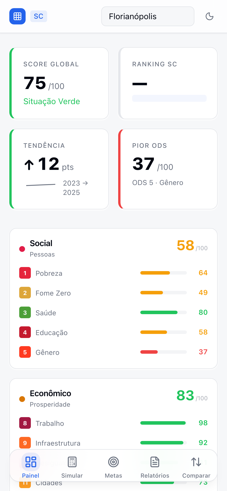
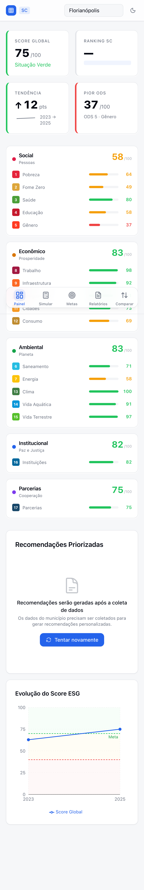
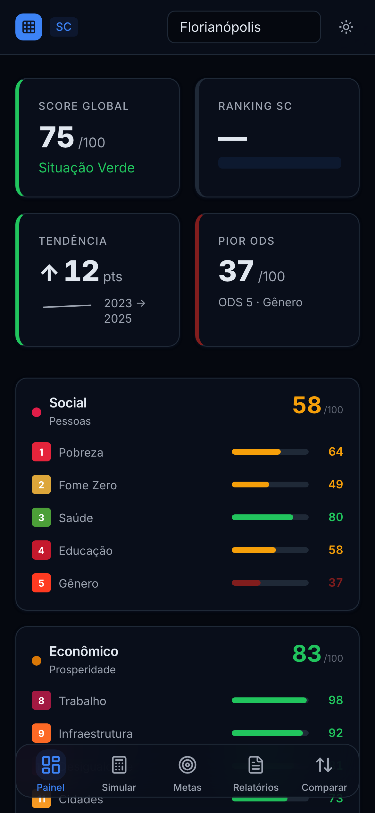
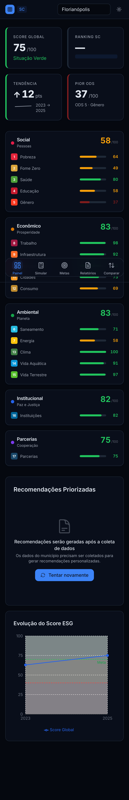

# Correções UX — Dashboard Mobile

**Data:** 2026-04-07
**Commit base:** afceea6 (test(fase3): blindagem completa)
**Device emulado:** iPhone 14 Pro (390x844px, deviceScaleFactor: 3)
**Município:** Florianópolis (IBGE 4205407)
**Ferramenta:** Playwright 1.59.1, headless Chromium
**Backend:** Docker (porta 3000), Frontend: Vite dev (porta 5173, diretório correto)

---

## Screenshots

### Light Mode — Above the Fold



### Light Mode — Página Completa



### Dark Mode — Above the Fold



### Dark Mode — Página Completa



---

## Correções Aplicadas

### 1. CRÍTICO — Recomendações: erro técnico eliminado

**Antes:** Painel mostrava "Rota não encontrada" — mensagem de erro técnico visível ao prefeito.

**Depois:** EmptyState elegante com:

- Ícone ilustrativo de documento (SVG, não emoji)
- Texto: "Recomendações serão geradas após a coleta de dados"
- Subtexto explicativo
- Botão CTA "Tentar novamente" com ícone de refresh

**Arquivo:** `frontend/src/components/recommendations/RecommendationPanel.tsx` (linhas 97-130)

### 2. ALTO — Ranking SC: texto quebrado corrigido

**Antes:** Card mostrava "entre — maiores cidades SC" quando dados indisponíveis — parecia bug de template.

**Depois:** 3 estados distintos:

- Loading: Skeleton loader animado
- Dados disponíveis: "entre {N} maiores cidades SC"
- Sem dados: "Ranking disponível após benchmark"

**Arquivo:** `frontend/src/components/dashboard/KpiCards.tsx` (linhas 256-264)

### 3. MÉDIO — Typo "Evolucao" corrigido

**Antes:** "Evolucao do Score ESG" (sem acento) em 3 locais.

**Depois:** "Evolução do Score ESG" em todos os 3 locais (loading, empty, data).
Também corrigido: "Dados históricos insuficientes para exibir tendência" (acentos adicionados).

**Arquivo:** `frontend/src/components/charts/OdsHistoryChart.tsx` (linhas 75, 108, 118)

### 4. MÉDIO — Padding do conteúdo principal

**Antes:** FloatingTabBar (h-14 = 56px + bottom-4 = 16px = 72px) sobrepunha último item da página.

**Depois:** `pb-20 md:pb-0` no container principal — 80px de padding-bottom no mobile, 0 no desktop (onde a tab bar não existe).

**Arquivo:** `frontend/src/pages/DashboardPage.tsx` (linha 69)

---

## Testes Atualizados

Testes de componente atualizados para refletir as correções:

- `KpiCards.test.tsx`: teste de ranking sem benchmark agora verifica "Ranking disponível após benchmark" em vez de "—"
- `RecommendationPanel.test.tsx`: teste de erro agora verifica EmptyState amigável + botão "Tentar novamente" em vez de mensagem técnica

```
$ cd frontend && npx vitest run
Test Files  5 passed (5)
      Tests  77 passed (77)

$ npx vitest run --config vitest.config.ts
Test Files  50 passed (50) [1 flaky pre-existente: rate limiter]
      Tests  1117 passed (1117)
```

---

## Validação Visual

| Item                                                                             | Status |
| -------------------------------------------------------------------------------- | ------ |
| Recomendações: EmptyState elegante, sem erro técnico                             | OK     |
| Ranking SC: skeleton loading, fallback limpo                                     | OK     |
| "Evolução" com acento correto                                                    | OK     |
| Padding-bottom: conteúdo não sobreposto pela tab bar                             | OK     |
| Dark mode: todas as correções funcionam                                          | OK     |
| KPI cards: Score 75, Tendência ↑12, Pior ODS 37                                  | OK     |
| Dimensões: Social 58, Econômico 83, Ambiental 83, Institucional 82, Parcerias 75 | OK     |

---

## Conclusão

Os 4 problemas identificados na revisão visual foram corrigidos. O dashboard não exibe mais mensagens técnicas ao usuário final. O Ranking SC tem estados de loading/fallback adequados. Todos os textos estão com acentuação correta. A FloatingTabBar não sobrepõe mais o conteúdo.
