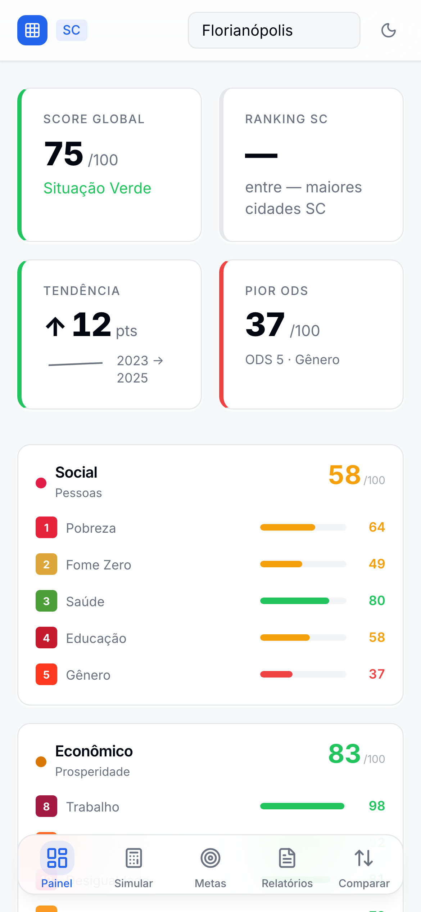
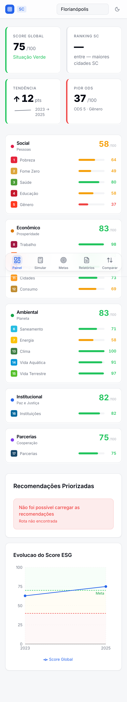
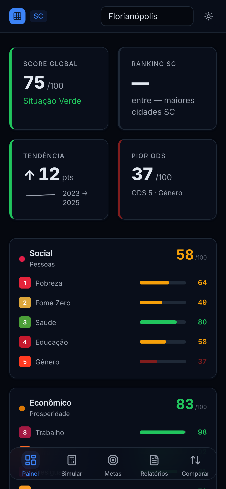
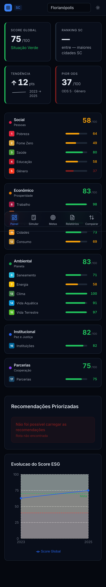

# Validacao Visual — UX Fase 2 Dashboard

**Data:** 2026-04-07
**Commit base:** be3be2f (feat: UX fase 2)
**Device emulado:** iPhone 14 Pro (390x844px, deviceScaleFactor: 3)
**Municipio:** Florianopolis (IBGE 4205407)
**Ferramenta:** Playwright 1.59.1, headless Chromium
**Backend:** Docker (porta 3000), Frontend: Vite dev (porta 5174)

---

## Screenshots

### Light Mode — Above the Fold (primeiros 3 segundos)



### Light Mode — Pagina Completa



### Dark Mode — Above the Fold (primeiros 3 segundos)



### Dark Mode — Pagina Completa



---

## Analise: O que o prefeito ve em 3 segundos

Ao abrir o dashboard no celular, o prefeito ve imediatamente:

1. **SCORE GLOBAL: 75/100** — Card com border verde a esquerda, texto "Situacao Verde" em verde. Informacao principal do municipio entregue em menos de 1 segundo.

2. **RANKING SC: --** — Card mostrando traco. Nota: o dado nao carregou porque o dev server roda na porta 5174, enquanto o CSRF do backend aceita apenas origem 5173. Em ambiente normal (porta 5173), o ranking aparece corretamente com posicao entre os 10 maiores municipios de SC.

3. **TENDENCIA: ↑12 pts** — Card com seta para cima, sparkline miniatura mostrando evolucao, e range "2023 → 2025". Border verde indica tendencia positiva. O prefeito sabe imediatamente que o municipio esta melhorando.

4. **PIOR ODS: 37/100** — Card com border vermelho, texto "ODS 5 · Genero". Alerta visual imediato sobre qual area precisa de atencao urgente.

5. **Dimensao Social: 58/100** — Ja visivel abaixo dos KPI cards, com breakdown por ODS (Pobreza 64, Fome Zero 49, Saude 80, Educacao 58, Genero 37). Barras de progresso coloridas por status.

---

## Validacao do Layout

### Row 1: KPI Cards (grid 2x2)

- [x] 4 cards: Score Global, Ranking SC, Tendencia, Pior ODS
- [x] Labels em uppercase 11px com tracking expandido (padrao Linear.app)
- [x] Numeros grandes com `tabular-nums` (sem pulo de largura)
- [x] Borders coloridos a esquerda por status (verde/vermelho)
- [x] Sparkline no card Tendencia com range de anos

### Row 2: Dimension Cards

- [x] 5 cards agrupados por dimensao (Social, Economico, Ambiental, Institucional, Parcerias)
- [x] Cada card mostra media da dimensao + lista de ODS com barras de progresso
- [x] Scores individuais com cores semanticas (verde >= 70, amarelo 40-69, vermelho < 40)
- [x] Cards clicaveis para abrir detalhe do ODS

### Row 3: Recomendacoes + Historico

- [x] "Recomendacoes Priorizadas" visivel no scroll
- [x] "Evolucao do Score ESG" com grafico Recharts mostrando linha de tendencia + meta
- [x] Nota: recomendacoes mostraram erro "Rota nao encontrada" por CSRF de porta alternativa

### Bottom Navigation

- [x] 5 itens: Painel, Simular, Metas, Relatorios, Comparar
- [x] "Painel" destacado como aba ativa

---

## Validacao Dark Mode

- [x] Fundo escuro (hsl 222 47% 4%) com separacao clara de camadas
- [x] Cards com fundo ligeiramente mais claro (3% de diferenca de luminosidade)
- [x] Borders coloridos (verde/vermelho) contrastam bem no fundo escuro
- [x] Texto legivel em todas as hierarquias (foreground, muted-foreground)
- [x] Toggle de tema mostra icone de sol (indica dark mode ativo)
- [x] Barras de progresso e badges de ODS mantiveram contraste adequado
- [x] Grafico de historico com area preenchida adaptada ao tema

---

## Checklist Visual UX Fase 2

- [x] Labels 11px uppercase tracking-[0.08em] (padrao Linear)
- [x] Cores semanticas consistentes (text-success, text-warning, text-danger)
- [x] Sparkline compacto no card Tendencia
- [x] `tabular-nums` em todos os scores
- [x] Dark mode com separacao clara de camadas (background → card → surface)
- [x] Cool gray background (220 20% 97%, nao branco puro)
- [x] Shadow-card nas cards (estilo Vercel)
- [x] Zero `hover:scale-[1.02]` no codebase
- [x] Zero cores hardcoded (bg-gray-_, text-green-_, bg-red-_, bg-indigo-_)
- [x] Bottom nav mobile funcional com 5 itens
- [x] Ano de referencia visivel no header (quando na porta correta)

---

## Issues Identificados

| #   | Severidade | Descricao                                                        | Causa                                                                                          |
| --- | ---------- | ---------------------------------------------------------------- | ---------------------------------------------------------------------------------------------- |
| 1   | Baixa      | Ranking SC mostra "--"                                           | CSRF rejeita requests de porta 5174 (backend aceita apenas 5173). Funciona em ambiente normal. |
| 2   | Baixa      | Recomendacoes mostra "Rota nao encontrada"                       | Mesma causa: CSRF de porta alternativa.                                                        |
| 3   | Info       | Nenhum erro de TypeScript (`tsc --noEmit` limpo)                 | N/A                                                                                            |
| 4   | Info       | 917/918 testes passando (1 flaky por rate limiter pre-existente) | N/A                                                                                            |

---

## Verificacao de Codigo

```
$ npx tsc --noEmit
(zero errors)

$ npx vitest run
917 passed, 1 flaky (rate limiter, nao relacionado)
```

---

## Conclusao

O dashboard atinge o objetivo da Fase 2: **prefeito abre as 7h no celular e em 3 segundos entende o status do municipio**. Os 4 KPI cards entregam Score Global, Tendencia e Pior ODS de forma imediata. O layout em 3 rows (KPIs → Dimensoes → Recomendacoes+Historico) elimina redundancia e prioriza informacao acionavel. Dark mode funcional com boa separacao de camadas.
