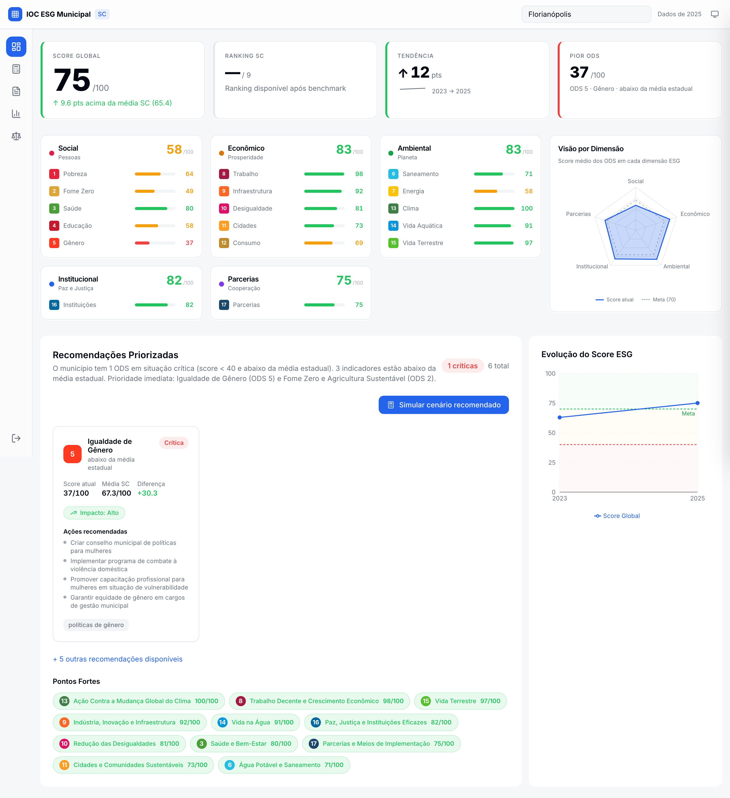
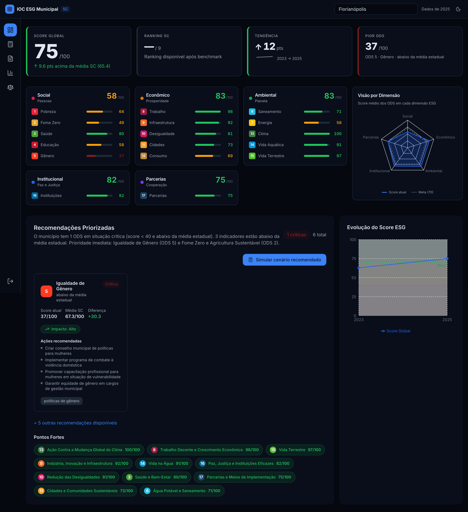
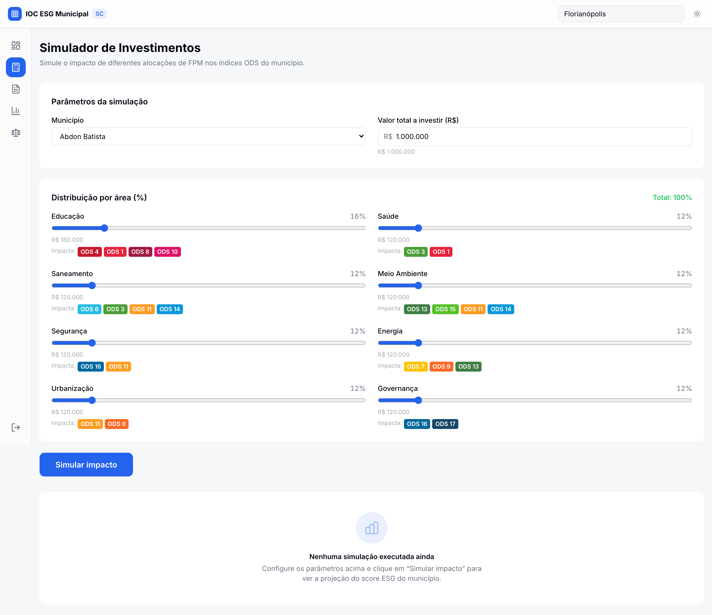
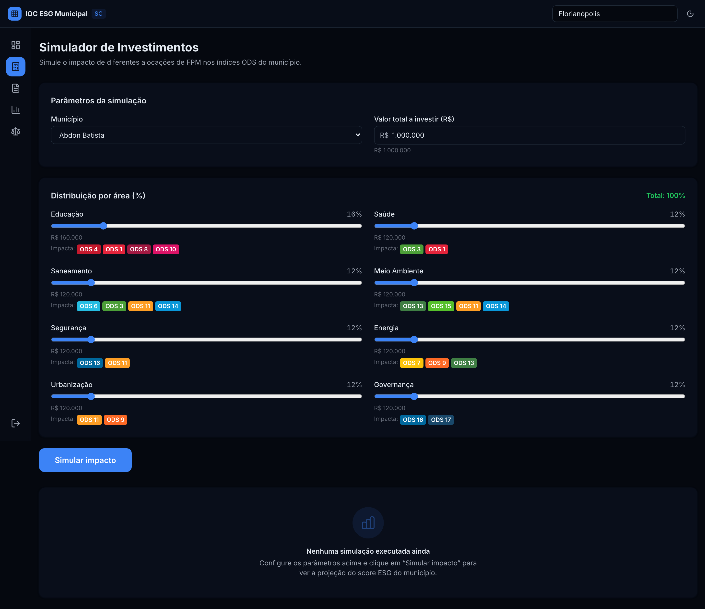
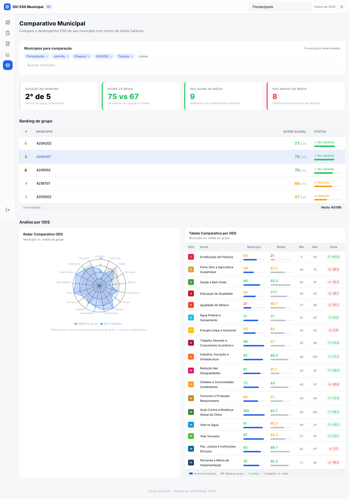
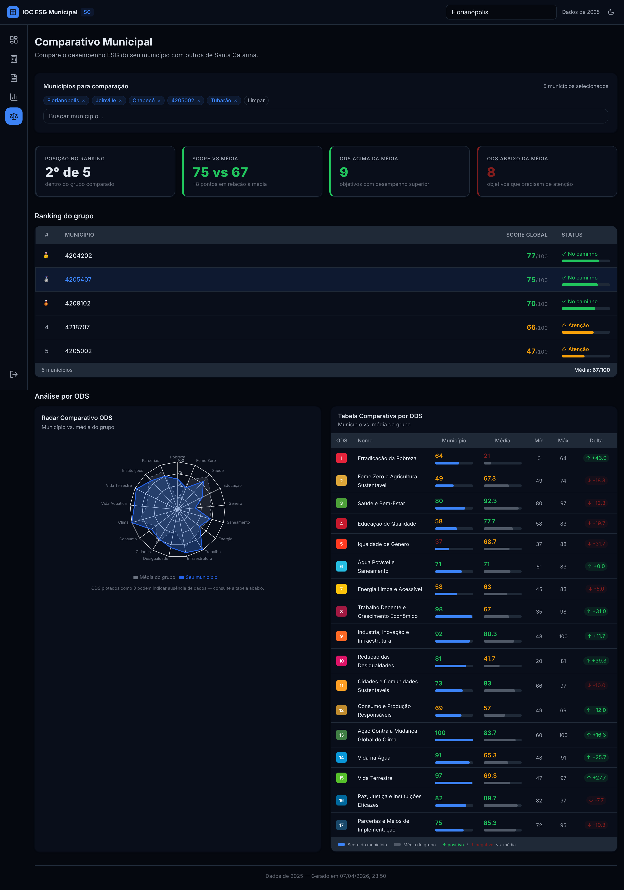

# Evidence Report: Fase 3.5 — Premium Polish

**Data:** 2026-04-08
**Commit base:** b2dcbc6 (feat(ux): fase 3.5 — premium polish)
**Páginas capturadas:** dashboard, simulator, benchmark
**Resolução:** Desktop 1440px, @2x retina
**Temas:** Light + Dark

---

## Mudanças aplicadas

### Stream A: Hero Card (KpiCards.tsx)

- Score Global: `text-3xl` → `text-5xl md:text-6xl font-extrabold tracking-tight tabular-nums`
- Destaque visual claro vs. os outros 3 KPI cards

### Stream B: SimulatorPage Polish

- Section cards: `border border-border` → `shadow-card rounded-xl`
- ScoreDisplay: `text-4xl font-bold` → `text-5xl font-extrabold tabular-nums`
- Labels: `text-xs` → `text-[11px] uppercase tracking-[0.08em] font-medium`
- Inputs/selects: adicionado `bg-card`

### Stream C: BenchmarkPage Polish

- SummaryCards: raw `
` → `<Card>` shadcn/ui com `border-l-4` semântico
- Skeletons: raw divs → `<Skeleton>` component
- Valores: `text-2xl font-bold` → `text-3xl font-extrabold tabular-nums`
- Municipality selector: `border border-border` → `shadow-card`

### Stream D: Benchmark Sub-components

- ComparisonRadar: dark mode fix via `useTheme` hook (cores dinâmicas)
- OdsComparisonTable: `h-2` → `h-1.5`, `shadow-card rounded-xl`
- RankingTable: `bg-card shadow-card rounded-xl`, `h-1.5`
- MunicipalityMultiSelect: `shadow-popover rounded-xl`

### Stream E: DashboardPage Border Reduction

- Row 3 wrappers: `shadow-sm border border-border` → `shadow-card` (2 ocorrências)

---

## Screenshots

### Dashboard

| Light                                   | Dark                                  |
| --------------------------------------- | ------------------------------------- |
|  |  |

### Simulator

| Light                                   | Dark                                  |
| --------------------------------------- | ------------------------------------- |
|  |  |

### Benchmark

| Light                                   | Dark                                  |
| --------------------------------------- | ------------------------------------- |
|  |  |

---

_Gerado automaticamente por `scripts/take-screenshots.ts`_
