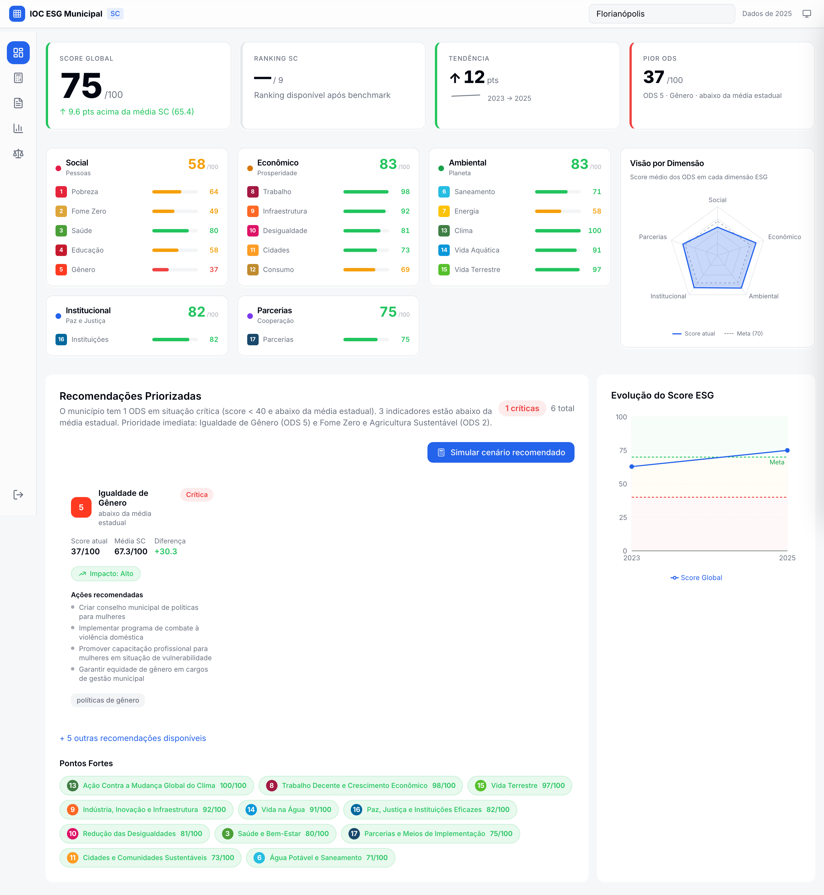
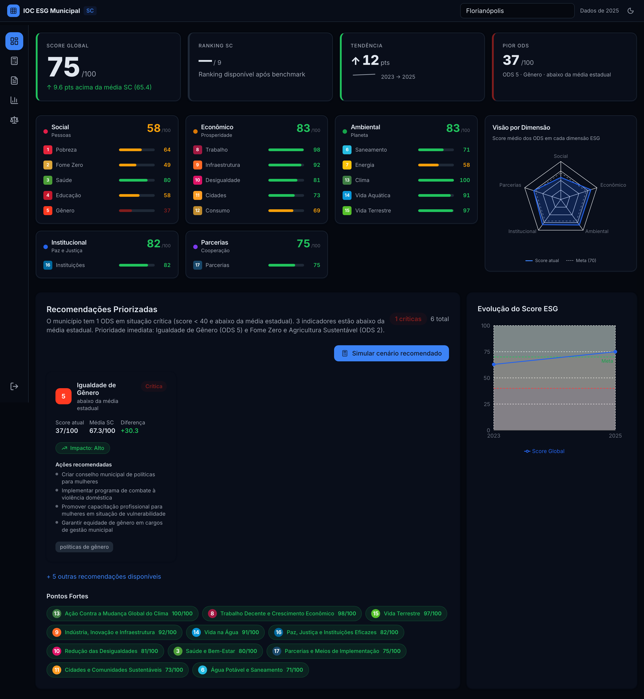
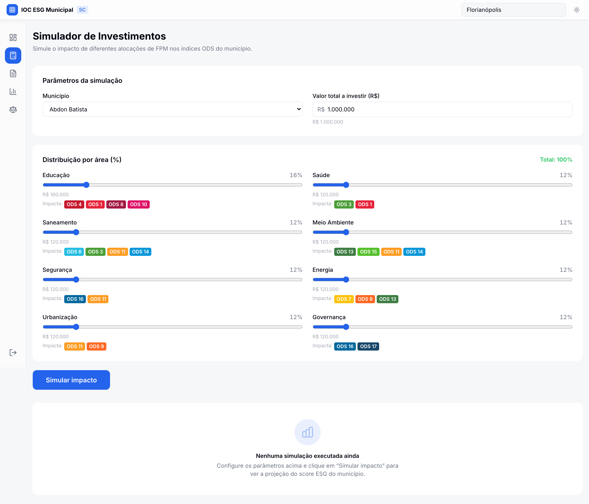
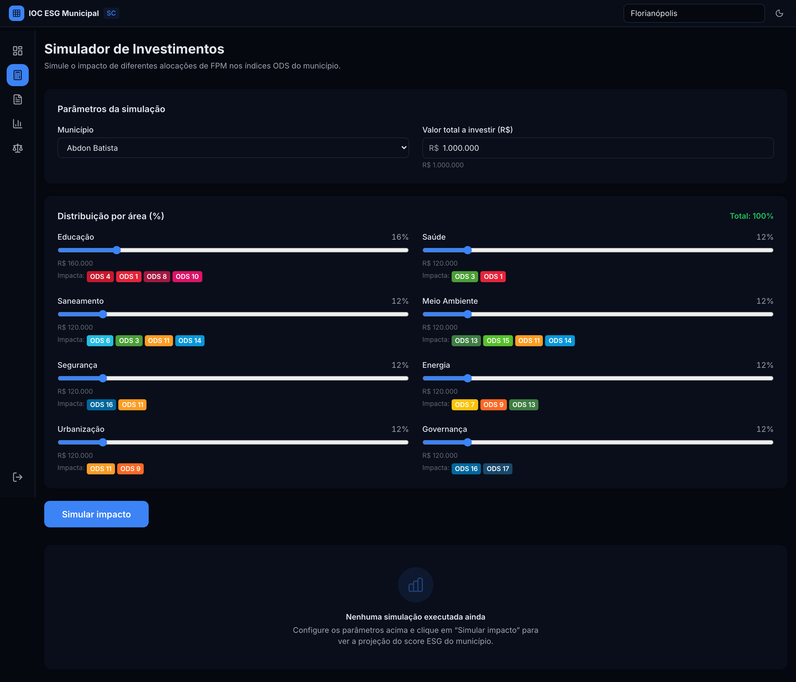
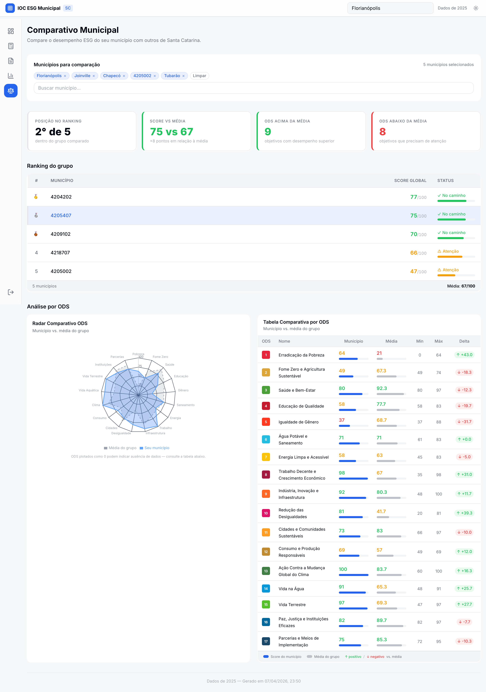
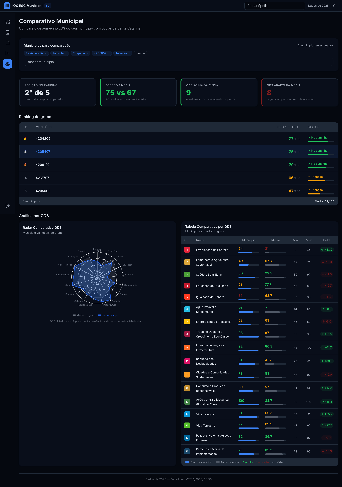

# Evidence Report: Fase 3.6 — Last Mile Design

**Data:** 2026-04-08
**Páginas capturadas:** dashboard, simulator, benchmark
**Resolução:** Desktop 1440px, @2x retina
**Temas:** Light + Dark

---

## Mudanças aplicadas

### 1. Remoção de borders em light mode

- OdsCard: `border border-border` → `border-l-4` (preserva accent ODS, remove border geral)
- OdsCardSkeleton: `shadow-sm border border-border` → `shadow-card border-0`
- RecommendationCard/Panel: `border border-border shadow-sm` → `border-0 shadow-card`
- MonitoringPage cards: `border border-border` → `shadow-card border-0`
- ErrorBoundary: `border border-border shadow-sm` → `border-0 shadow-card`
- Tooltips (Radar, History): `border border-border` → `border-0 shadow-popover`

### 2. Progress bars rounded-full

- OdsDimensionGrid skeleton: `rounded` → `rounded-full`
- OdsCardSkeleton: `rounded` → `rounded-full`

### 3. Header compacto

- AppShell header: `h-14` (56px) → `h-12` (48px)

---

## Screenshots

### Dashboard

| Light                                   | Dark                                  |
| --------------------------------------- | ------------------------------------- |
|  |  |

### Simulator

| Light                                   | Dark                                  |
| --------------------------------------- | ------------------------------------- |
|  |  |

### Benchmark

| Light                                   | Dark                                  |
| --------------------------------------- | ------------------------------------- |
|  |  |

---

_Gerado automaticamente por `scripts/take-screenshots.ts`_
