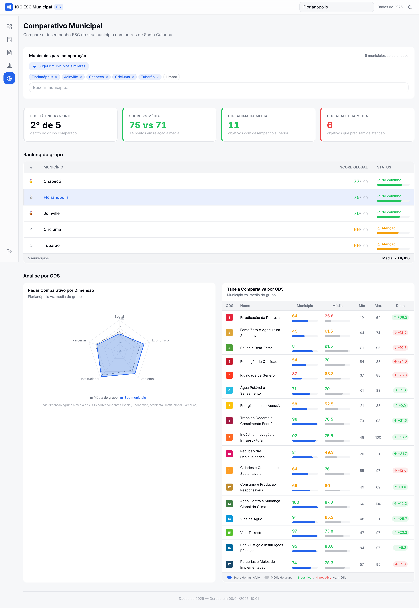
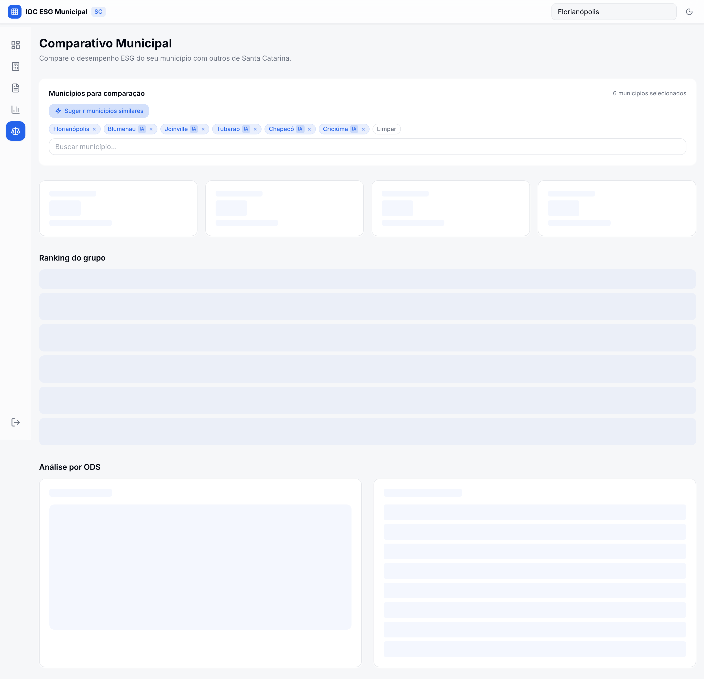
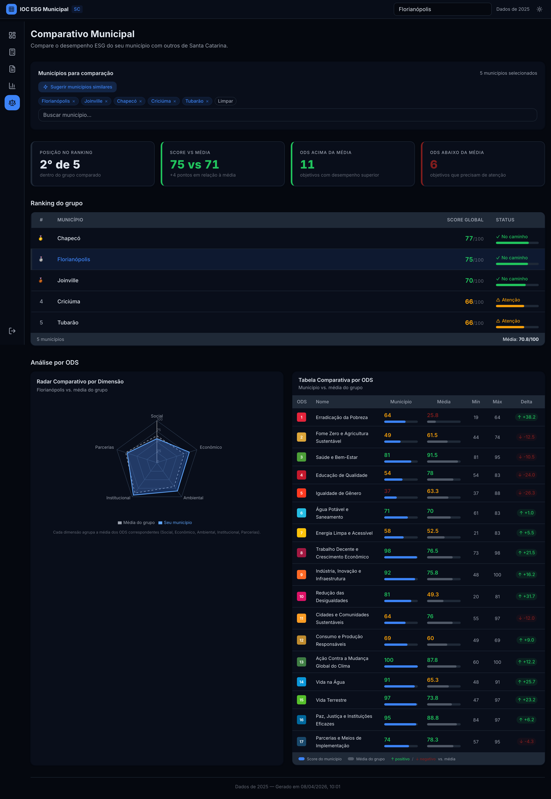

# Evidence Report: Fase 4B — Clustering Peer-to-Peer

**Data:** 2026-04-08
**Feature:** Sugestão automática de municípios similares via clustering
**Resolução:** Desktop 1440px @2x
**Temas:** Light + Dark

---

## Fluxo do Usuário

1. O usuário acessa a página **Comparativo Municipal** (`/benchmark`).
2. Acima do seletor de municípios, o botão **"Sugerir municípios similares"** está visível.
3. Ao clicar no botão, a API `GET /api/municipalities/:ibgeCode/peers?topN=5` é chamada.
4. O sistema calcula os 5 municípios mais similares ao município principal (Florianópolis) usando distância euclidiana em z-scores de população, PIB per capita e macrorregião.
5. Os municípios sugeridos substituem a seleção manual. Cada chip sugerido exibe o badge **"IA"** para indicar que foi selecionado automaticamente pelo algoritmo.
6. O ranking, radar e tabela ODS são atualizados com o novo grupo de municípios.

---

## Screenshots

### 1. Light Mode — Antes de clicar "Sugerir"

Estado inicial com 5 municípios selecionados manualmente (default).
Botão "Sugerir municípios similares" visível acima dos chips.

### 2. Light Mode — Após clicar "Sugerir" (badges IA)

6 municípios selecionados: Florianópolis (base) + 5 peers sugeridos.
Badges "IA" visíveis em Blumenau, Joinville, Tubarão, Chapecó, Criciúma.
Contador atualizado para "6 municípios selecionados".

### 3. Dark Mode — Após clicar "Sugerir" (badges IA)

Mesma seleção de peers em dark mode.
Todos os componentes (ranking, radar, tabela ODS) renderizados corretamente.
Botão "Sugerir municípios similares" com destaque visual preservado.

---

## Algoritmo de Clustering

- **Variáveis:** população, PIB per capita, macrorregião (6 regiões SC)
- **Método:** Normalização z-score + distância euclidiana
- **Dataset:** 20 maiores municípios de SC com dados IBGE reais
- **Resultado para Florianópolis:** Blumenau, Joinville, Tubarão, Chapecó, Criciúma (5 peers mais similares)

---

_Gerado automaticamente por `scripts/screenshot-fase4b.ts`_
