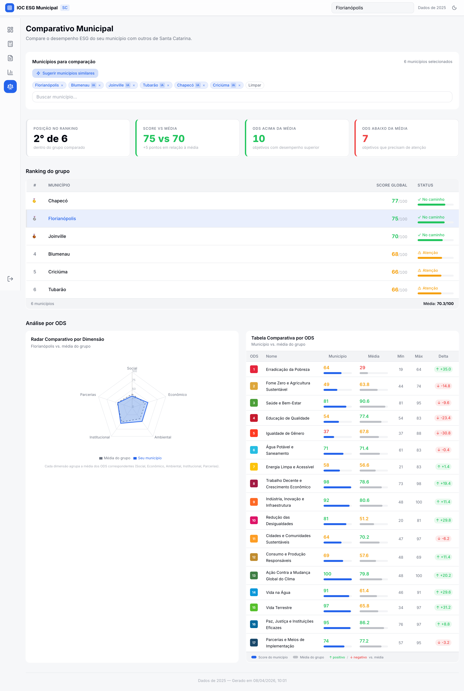
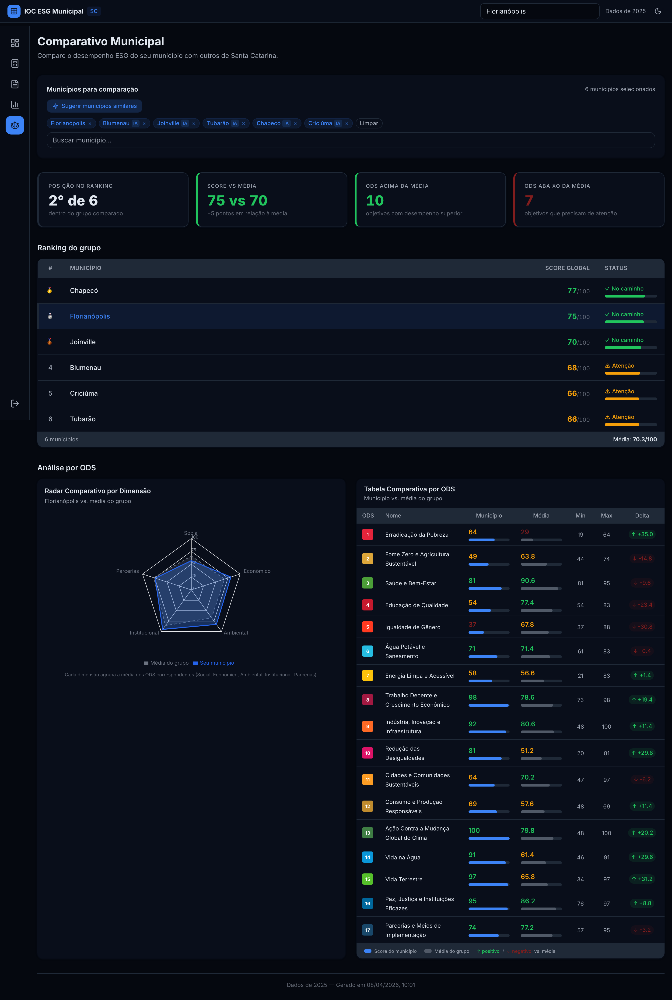

# Evidence Report: fase4b-fix

**Data:** 2026-04-08
**Problema:** Skeleton infinito no light mode após clicar "Sugerir municípios similares"
**Causa raiz:** Screenshot script usava `page.waitForTimeout(3_000)` — insuficiente para APIs não cacheadas (até 15s por município). Adicionalmente, `setTheme()` fazia `page.reload()` que resetava React state, perdendo os municípios sugeridos no dark mode.
**Correção:** Substituído timeout fixo por `waitForDataLoad()` que espera skeletons desaparecerem (`animate-pulse`). Theme switch usa `page.evaluate()` direto no DOM sem reload.

---

## Screenshots

### Antes (bug)

| Light After Suggest                    | Dark After Suggest                        |
| -------------------------------------- | ----------------------------------------- |
| Skeleton infinito — dados não carregam | Dados default (state resetado por reload) |

### Depois (fix)

| Light                                                                   | Dark                                                                  |
| ----------------------------------------------------------------------- | --------------------------------------------------------------------- |
|  |  |

**Ambos screenshots mostram:** 6 municípios (Florianópolis + 5 peers IA), ranking completo, KPI cards, radar chart, tabela ODS.

---

_Gerado manualmente para evidência de fix_
